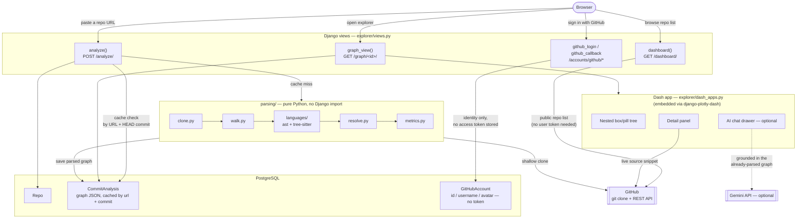

# Canopy

**Live at [canopy-v7hb.onrender.com](https://canopy-v7hb.onrender.com/)**

Paste a GitHub repo link in. Canopy builds a hierarchical, explorable diagram of the codebase: repo → top-level modules/packages → files → classes → functions. Functions are the leaf nodes — the actual building blocks. Clicking any node shows what job it's responsible for, its source code, and its callers/callees. Supports Python, JavaScript, TypeScript, Go, Java, Rust, C, C++, Ruby, PHP, and C# in one repo at once — a file in any other language is skipped rather than erroring, so any repo can be pasted in. Fully responsive down to phone-sized screens. An optional AI chat panel (off unless a Gemini API key is configured) answers questions about the repo you're looking at, grounded strictly in that repo's own parsed graph. Optional "sign in with GitHub" surfaces your own public repos in a one-click dashboard — the sign-in is identity-only, no access token from it is ever stored.

Think "Obsidian's graph view, but auto-generated from a codebase instead of hand-written notes," combined with the backlinks idea: a function's callers/callees matter just as much as its position in the file tree.

## Why

Existing tools stop short of this combination:

- **GitDiagram** — LLM-generated Mermaid diagrams, not structurally accurate.
- **DeepWiki** — full wiki-style explanation + chat, not an explorable structural graph.
- **Sourcetrail** (unmaintained since 2021) — the closest structural blueprint, but abandoned.
- **Swimm**, **CodeSee** (defunct) — similar auto-generated maps, no longer around.

None of them drill all the way down to individual functions as leaf nodes, and none combine "explore the hierarchy" with "understand exactly the node you're looking at" in one seamless interaction. That's the gap Canopy fills.

## Architecture

One Django project (`canopy/`) with a single app (`explorer/`). Django owns routing, models, auth, and admin; the parsing engine (`parsing/`) is a pure-Python package with no Django dependency at all; the interactive explorer is a [Dash](https://dash.plotly.com/) app embedded directly inside a Django template via `django-plotly-dash`. Everything shares one PostgreSQL database, which doubles as the analysis cache.



A few things the diagram is making explicit:

- **The parsing pipeline never imports Django.** `analyze_local_repo()` takes a directory and a commit hash and returns a plain dict of nodes/edges/imports — it's tested (and testable) as ordinary Python, independent of the web layer around it.
- **The cache key is the repo URL plus its HEAD commit hash**, checked via a cheap `git ls-remote` before deciding whether to re-run the (much more expensive) clone-and-parse pipeline at all.
- **Sign-in never touches the analysis path.** GitHub OAuth exists purely to identify who's signed in and list their own public repos for convenience — the actual clone/parse/analyze flow it feeds into is the exact same anonymous, public-repo-only pipeline as pasting a URL by hand.
- **The AI chat is a dead end, not a hub.** It reads an already-computed `CommitAnalysis` row to build context for Gemini; nothing about the graph, the cache, or any other feature depends on it existing.

## How it works

1. **Ingest** — shallow `git clone --depth 1` of the given repo URL into a temp folder; walk every file whose extension has a registered language.
2. **Parse** — each file is dispatched to the analyzer registered for its language: Python's built-in `ast` module, or a shared [tree-sitter](https://tree-sitter.github.io/)-based extractor (one generic engine, configured per language) for everything else. Either way: modules, classes, functions/methods (including nested), docstrings, and line ranges come out as the same language-agnostic `Symbol` shape.
3. **Call graph** — walk each function body for call expressions, resolve them against a repo-wide symbol table (same file first, then repo-wide, restricted to the caller's own language). Unresolved/dynamic calls are marked external/unknown rather than guessed.
4. **Metrics** — lines of code, rough cyclomatic complexity, and fan-in/fan-out per function.
5. **Persist** — the parsed graph (nodes + edges as JSON) is cached in Postgres, keyed by repo URL + commit hash.
6. **Render** — a nested box/pill tree (repo → packages → modules → classes → functions), collapsed past the function level by default, fully responsive (the detail panel becomes a full-screen drawer on narrow screens instead of a fixed sidebar). Clicking a node opens a side panel with its docstring, source snippet (syntax-highlighted, fetched live from GitHub), metrics, and clickable callers/callees. Toggles show/hide call edges, tests, and vendored dependencies; a search bar jumps straight to any qualified name.
7. **Chat (optional)** — a drawer in the explorer view that answers free-form questions about the currently-open repo, grounded in that repo's already-parsed graph (symbol names, docstrings, structure, call edges) rather than free-associating. Entirely separate from the deterministic pipeline above — it only exists, and only ever runs, when `GEMINI_API_KEY` is set; the graph/parsing stays 100% static analysis either way. Can be expanded into a full-height side panel for a longer conversation.
8. **Sign in (optional)** — "sign in with GitHub" is identity-only (no OAuth scope requested, no access token ever stored) and unlocks a dashboard listing your own public repos, pulled from GitHub's public API, each one click away from step 1 above.

## Tech stack

- **Web framework:** Django, with `django-plotly-dash` embedding a Dash app directly inside Django views/templates — one Python codebase, no separate frontend build.
- **Interactive graph:** a hand-rolled Dash tree renderer (no Cytoscape/D3) — plain `html.Div`/`html.Button` components styled with a custom CSS design system (OKLCH color tokens, JetBrains Mono/IBM Plex Mono), fully responsive with its own mobile breakpoints, plus one clientside (pure-JS, no server round-trip) callback for instant node-selection highlighting and scroll-into-view.
- **Parser:** Python's built-in `ast` module for Python; [tree-sitter](https://tree-sitter.github.io/) grammars behind one shared generic extractor for JavaScript, TypeScript, Go, Java, Rust, C, C++, Ruby, PHP, and C#. Both sit behind the same small `LanguageAnalyzer` interface, so adding another language later is additive (a grammar dependency + a small config table), not a rewrite.
- **Storage:** PostgreSQL via Django's ORM — `Repo` / `CommitAnalysis` models, with a `JSONField` holding the parsed graph. Doubles as the analysis cache. A third, small `GitHubAccount` model links a Django `User` to a GitHub identity — id/username/avatar only, nothing else.
- **Auth:** a minimal, hand-rolled GitHub OAuth flow (`explorer/github_oauth.py`) — no third-party auth library, no scope requested beyond identity, no personal access token ever persisted. The dashboard's repo list comes from GitHub's public per-user API instead, which needs no token at all.
- **Hosting:** Render (Docker-based web service + managed Postgres), WhiteNoise for static files, gzip compression.
- **No background job queue for v1** — parsing runs synchronously in a Django view.
- **AI chat, optional and off by default:** the [official `google-genai` SDK](https://pypi.org/project/google-genai/) against a Gemini flash-lite model, only when `GEMINI_API_KEY` is set. The graph/parsing pipeline itself remains 100% static analysis, no LLM involved — chat is a separate, clearly-optional layer that answers questions *about* the already-deterministic graph, never influences it.

## Key decisions

| Decision | Why |
|---|---|
| No LLM in the parsing/graph pipeline | Keeps the core product free, fast, deterministic, infra-light — the structural graph itself is never LLM-derived. |
| Static analysis over LLM-guessed structure | More accurate than asking an LLM to infer architecture — avoids hallucinated relationships. |
| tree-sitter for every language beyond Python | Deterministic, official grammar packages, C-speed — extends "static analysis only" to multi-language instead of trading it away. One generic extractor configured per language, rather than a hand-written visitor per language. |
| Chat as a separate, optional, off-by-default layer | Answering questions *about* an already-computed graph is a genuinely different (and lower-stakes) job than *computing* the graph — bolting it on as an opt-in extra keeps the deterministic core's guarantees intact rather than trading them away. |
| GitHub sign-in never requests a scope or stores a token | The dashboard only ever needs to show *public* repos, which GitHub's API serves with no auth at all — asking for a scope (and having to protect a resulting personal access token at rest) would be real risk taken on for zero functional benefit. |
| Dash (not React) | Keeps the whole build in one Python codebase — a hand-rolled component tree instead of a graph-visualization library, once the UI moved to a nested box/pill layout traced from a reference design rather than a force-directed graph. |
| Django, via `django-plotly-dash` | Django owns routing/models/auth/admin; Dash owns the interactive graph. |
| PostgreSQL over SQLite | Production-realistic setup, better concurrent-write handling, and stronger native JSON support/indexing for the parsed graph data. |
| No background job queue for MVP | Parsing is fast without an LLM in the loop, so it runs synchronously in a Django view. |

## Getting started

```bash
# clone and enter the repo
git clone https://github.com/adityamittal-dot/Canopy.git
cd Canopy

# create and activate a virtualenv
python -m venv venv
venv\Scripts\activate        # Windows
source venv/bin/activate     # macOS/Linux

# install dependencies
pip install -r requirements.txt

# start Postgres (via Docker) and run migrations
docker compose up -d db
python manage.py migrate

# run the dev server
python manage.py runserver
```

Or run the whole stack (app + database) via Docker:

```bash
docker compose up --build
```
